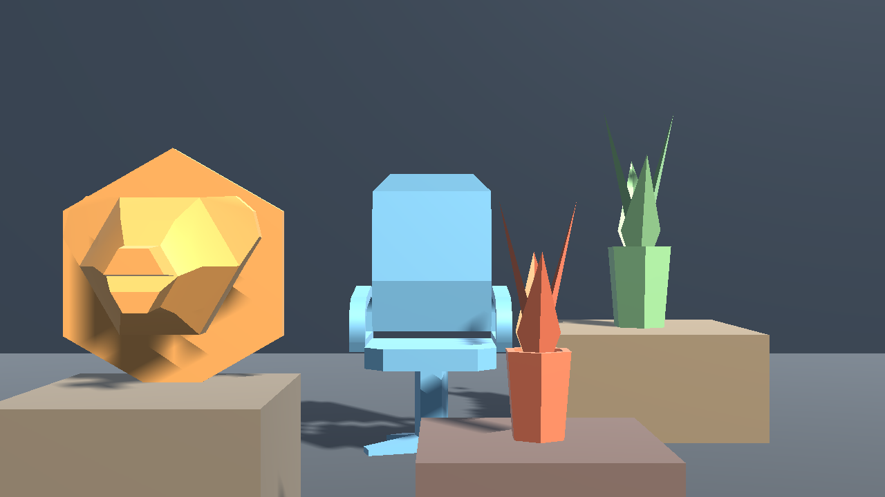

# Head Tracked Display

[Demo](#run-the-demo) · [Unity package](#use-it-in-another-unity-project) · [Tracking backends](#tracking-backends) · [Geometry](#physical-window-geometry) · [Calibration](#calibration)

Head Tracked Display makes an ordinary monitor behave like a window into a fixed 3D scene. A webcam estimates one viewer's eye position. Unity moves the render camera to that position and updates an **off-axis perspective projection** for the measured screen. Put any ordinary 3D model behind or in front of the screen plane; no script or head-driven rotation is added to the model.



This is a **single-viewer, monoscopic** display. It provides motion parallax, not separate images for the left and right eyes.

## What is in this repository?

| Path | Purpose |
| --- | --- |
| [`Packages/com.headtracked.display`](Packages/com.headtracked.display) | Reusable Unity Package Manager package: projection, calibration, eye pose, tracker interface, and optional tracking sources. |
| [`Demo`](Demo) | Unity 6.3 LTS URP project with three real FBX meshes at different physical depths. |
| [`python_tracker`](python_tracker) | MediaPipe Face Landmarker webcam tracker and OpenCV camera calibration tool. |
| [`tools`](tools) | Optional Unity plugin setup and printable checkerboard. |

## Run the demo

### On the prepared Windows PC

Double-click [`Run-HeadTrackedDemo.cmd`](Run-HeadTrackedDemo.cmd). It starts the local Windows player and the Python tracker using webcam **0**. For webcam **1**, run `./Run-HeadTrackedDemo.cmd 1` in PowerShell. The launcher stops the tracker when you close the player with **Alt+F4**.

The Windows player lives at `Builds/HeadTrackedDemo/HeadTrackedDemo.exe` in the prepared checkout. Build output, the Python environment, and the Face Landmarker model are deliberately excluded from Git; a new clone needs the setup below.

In the demo, wait for **Tracking: FACE FOUND**. Move your head left/right, up/down, and toward/away from the monitor. If it stays at **NO FACE**, check the webcam number, lighting, and camera permission. Enter the physical display measurements and capture a reference distance before judging the geometry.

### Build and run from source

**Requirements:** Windows, a webcam, Python 3, and Unity **6.3 LTS** with Windows Build Support. The demo uses URP 17.3.0. The Python path pins `mediapipe==1.1.0`; the optional Unity-native path uses MediaPipe Unity Plugin v0.16.3. A normal monitor is sufficient.

```powershell
git clone https://github.com/lollipop190000/head-tracked-display.git
cd head-tracked-display
py -3 -m venv python_tracker/.venv
./python_tracker/.venv/Scripts/python.exe -m pip install -r python_tracker/requirements.txt
py -3 python_tracker/download_model.py
```

Open [`Demo`](Demo) as a project in Unity. Open `Assets/Scenes/HeadTrackedDemo.unity` and press Play. The scene and URP settings are checked in; **Head Tracked → Create or refresh demo scene** is available if you want to regenerate them. In another PowerShell window, start the tracker:

```powershell
./python_tracker/.venv/Scripts/python.exe python_tracker/tracker.py --list-cameras
./python_tracker/.venv/Scripts/python.exe python_tracker/tracker.py --camera 0
```

For a standalone player, build the enabled demo scene for **Windows x64** in Unity Build Profiles and save it as `Builds/HeadTrackedDemo/HeadTrackedDemo.exe`. Then use the launcher above. If the Unity CLI is installed, the equivalent command is:

```powershell
unity build Demo --target StandaloneWindows64 --output-path Builds/HeadTrackedDemo/HeadTrackedDemo.exe
```

## Tracking backends

Both sources produce the same screen-relative eye observation. You can switch them in the demo without changing the projection code.

| Backend | Setup | How it runs |
| --- | --- | --- |
| Python bridge | Install `python_tracker/requirements.txt` and the task model as above. | Python reads webcam frames, runs Face Landmarker, and sends landmarks to Unity over `127.0.0.1:8765`. Video frames are not sent to Unity. |
| Unity MediaPipe | Run the command below, then let Unity reimport packages. | `MediaPipeUnitySource` reads the selected webcam and runs Face Landmarker inside Unity. The plugin's Windows CPU support is experimental and needs testing on the target PC. |

```powershell
py -3 tools/setup_native_plugin.py
py -3 python_tracker/download_model.py
```

The plugin installer downloads and SHA-256 checks the pinned upstream archive (about 290 MB). The archive is ignored by Git. In the demo, press **Unity MediaPipe** and select a webcam from the device list. Press **Python bridge** to return to the external tracker. See [third-party components](THIRD_PARTY.md) for sources and licenses.

Both backends request MediaPipe's facial transformation matrix. Its horizontal axis is used **only to correct the apparent narrowing of the eye spacing when the face yaws**. Head orientation is never applied to the virtual camera or models. At extreme profile angles, the eye observation is rejected rather than allowing an unstable distance estimate.

## Calibration

### Basic setup

Measure the visible screen width and height, the webcam lens position relative to the screen center, and your eye distance from the screen. Enter them in the demo settings. The initial 53 × 30 cm screen, webcam 17 cm above and 2.5 cm in front of the screen, and 60 cm eye distance are examples, **not measurements of your hardware**.

Sit at the entered distance while your face is visible and press **Capture reference distance**, then **Save calibration**. Use **Mirror webcam X** if left/right motion appears reversed; use **Webcam pitch** if the lens points up or down. Run full screen and keep the measured screen aspect ratio close to the rendered aspect ratio. The settings panel reports an aspect mismatch and shows the current eye position, source status, and tracking state.

### Camera intrinsics (optional)

Print [`tools/checkerboard_9x6_24mm.svg`](tools/checkerboard_9x6_24mm.svg) on landscape A4 paper at **100% scale** and verify that each square is 24 mm wide. Capture at least 12 varied views:

```powershell
./python_tracker/.venv/Scripts/python.exe python_tracker/calibrate_camera.py --camera 0
```

Press Space for each valid view and Q to finish. In Unity, press **Reload camera intrinsics**, enable **Use precise camera calibration**, and enter your measured interpupillary distance in millimeters. A single webcam still has depth and pose estimation error, particularly with occlusion, glasses, or strong face rotation.

## Physical window geometry

The screen is a fixed rectangle at local `Z = 0`; local `+Z` points **behind** the monitor, into the virtual scene. Let the viewer's eye be `E = (eₓ, eᵧ, −d)` and a fixed model point be `P = (pₓ, pᵧ, z)`. The ray from the eye to that point crosses the screen at

```text
Sₓᵧ = Eₓᵧ + [ d / (d + z) ] (Pₓᵧ − Eₓᵧ)
```

`OffAxisProjection` chooses the asymmetric frustum so Unity draws `P` at exactly that screen crossing. The render camera translates with the eye but keeps the screen plane's orientation. Models retain their own world position and rotation. A pure face turn with a stationary eye position therefore should not move or rotate a model. A real eye translation reveals a different side of a 3D object, as looking through a physical window would.

For example, at a 60 cm viewing distance, a 10 cm eye move to the right shifts a centered point **30 cm behind** the screen by about **3.3 cm on the screen**. A point on the screen plane does not shift; a point in front shifts in the opposite direction. This is physical motion parallax, not model rotation. The [Unity custom projection matrix API](https://docs.unity3d.com/ScriptReference/Camera-projectionMatrix.html) is used to render it.

## Use it in another Unity project

Install the package in Unity Package Manager with **Add package from disk** and select [`Packages/com.headtracked.display/package.json`](Packages/com.headtracked.display/package.json), or use this Git URL:

```text
https://github.com/lollipop190000/head-tracked-display.git?path=/Packages/com.headtracked.display
```

Create a Transform at the physical screen center with scale `(1,1,1)` and local `+Z` into the scene. Add `HeadTrackedDisplay` to the render camera, add one `HeadObservationSource`, and assign both the screen Transform and source to the display component. Set `DisplayCalibration` measurements. Any ordinary 3D mesh placed relative to this plane uses the same camera projection; it needs no tracking script. The package [README](Packages/com.headtracked.display/README.md) has the shorter integration checklist.

Game code can read `EyePositionMeters`, `IsTracking`, `Confidence`, and `SourceStatus`, or subscribe to `PoseUpdated`. `Confidence` is currently a binary face-found value, not a graded landmark quality estimate. The view eases back to its neutral position after tracking loss.

## Validation and limitations

The automated suite checks screen corners, physical eye-to-object sightlines at multiple depths, Unity's actual camera viewport projection, parallax direction and scale, and yaw-compensated distance in basic and precise modes. The latest run passed **14/14 Unity EditMode**, **2/2 Unity PlayMode with the optional plugin**, and **3/3 Python protocol** tests. Run them with Unity Test Runner's EditMode and PlayMode tabs, and run the Python tests with:

```powershell
./python_tracker/.venv/Scripts/python.exe -m unittest discover -s python_tracker -p 'test_*.py' -v
```

The package was also installed in a separate fresh Unity URP project. Both webcams on the development PC processed frames with the Python backend; a native PlayMode webcam test processed a frame with the optional plugin. Human head movement, face loss/re-entry, latency, and the final yaw correction still require a live viewer test on the target monitor.

A conventional monitor cannot send different images to each eye, and its bezel clips objects meant to appear in front of the plane. The result depends on accurate screen and webcam measurements, a single viewer, and reasonably stable face tracking. Screen lighting and color also affect how physically present the scene feels.

## License

Code is [MIT licensed](LICENSE). The demo FBX meshes and optional dependencies have separate provenance and terms in [THIRD_PARTY.md](THIRD_PARTY.md).
