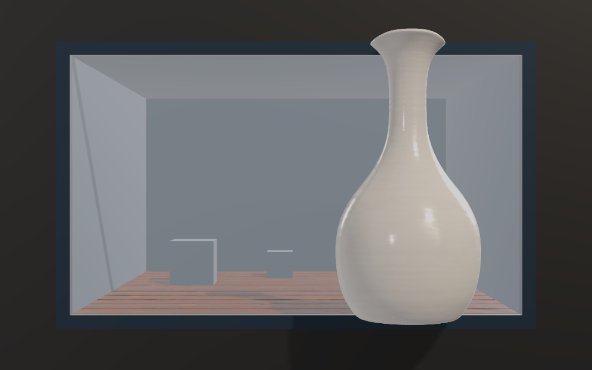
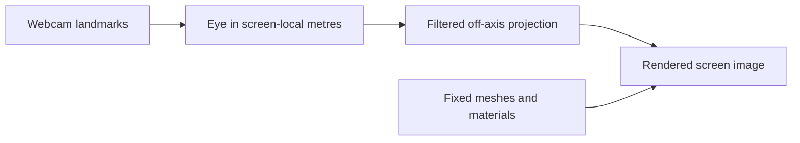

# Head Tracked Display

A reusable Unity package that makes a normal monitor behave like a window into a fixed 3D scene. A webcam estimates one viewer's eye position; an off-axis projection uses the measured screen rectangle. Ordinary models keep their transforms and materials. This is a **single-viewer, monoscopic** display.



*Unity render of the stationary comparison scene, with billboard dressing and surface detail enabled. The model stays fixed; head tracking changes the viewing position.*

## Repository

| Path | Responsibility |
| --- | --- |
| [Packages/com.headtracked.display](Packages/com.headtracked.display) | Reusable projection, calibration, observations, interchangeable tracking sources and optional scene dressing. The core assembly has no demo assets or URP dependency. |
| [Demo](Demo) | Unity 6.3 LTS URP comparison environment, UI, example assets and diagnostic layouts. |
| [python_tracker](python_tracker) | Optional MediaPipe/OpenCV webcam tracker and camera calibration. |
| [tools](tools) | One Windows launcher, optional plugin setup and asset preparation. |

For your own project, start with the [package integration guide](Packages/com.headtracked.display/README.md). Its use does not require the demo UI, assets or launch scripts.

## Run the demo

Double-click [Run-HeadTrackedDemo.cmd](Run-HeadTrackedDemo.cmd) on a prepared Windows checkout.

```powershell
./Run-HeadTrackedDemo.cmd                 # webcam 0
./Run-HeadTrackedDemo.cmd -Camera 1       # another webcam
./Run-HeadTrackedDemo.cmd -NoTracker      # visual comparisons without a webcam
./Run-HeadTrackedDemo.cmd -Stop           # stop this checkout's player and tracker
```

**Alt+F4** closes the player and stops its tracker. A heartbeat releases the webcam if the launcher disappears. Builds, Python environments and the downloaded face model are excluded from Git; a new clone needs the setup below.

The same entry point can launch another Unity project using `-UnityProject <directory> -PlayerPath <exe> -TrackerRoot <technology checkout or python_tracker directory>`. Relative paths are resolved from the current shell directory. For example:

```powershell
./Run-HeadTrackedDemo.cmd -UnityProject "../newyork_3d/ManhattanViewer" -PlayerPath "../newyork_3d/Builds/ManhattanViewer/ManhattanViewer.exe" -TrackerRoot "."
```

Repeat those target arguments with `-Stop` to stop that player and its managed tracker. Target company/product names determine the persistent calibration path; player executable paths determine process matching, mutexes, heartbeat files and logs. `Player.log` and tracker logs are written beside the executable. Other targets and manually started trackers are not terminated. See [launcher details](docs/launcher.md).

First launch asks only for **visible screen width, height and eye-to-screen distance**. Measure these values; the examples are not hardware measurements. Sit at the entered distance. Starting captures a reference if a face is available; otherwise capture it later under Settings.

The fixed comparison scene contains a stationary 16 cm ceramic vase, wood floor and billboard chamber. All three switches operate on that same scene:

| Switch | ON | OFF | Retained |
| --- | --- | --- | --- |
| Head tracking | Camera follows eye position. | Holds the viewpoint when turned off; measurements continue. | Models and physical projection. |
| Billboard effect | Frame, surround, chamber and depth references visible. | Hides only the dressing. | Content, camera, lighting and render quality. |
| Surface detail | Original textures, normal maps and material finish. | Plain matte material variants. | Geometry, submesh slots, placement, camera and lighting. |

Compare one switch at a time or any combination. **F1** hides the UI. **Settings / F2** opens one drawer on the right:

- **Calibration:** dimensions, webcam placement, IPD, reference capture, intrinsics and backend.
- **Appearance:** edge stability, render scale, chamber dimensions and optional animation. Leave animation off for stationary comparisons.
- **Layouts:** explicit content changes and original/fixation/depth/material experiments. Return to the fixed comparison scene for all three primary switches.
- **Diagnostics:** filtering, distance hold/correction, pose/gaze readings, gaze calibration and CSV recording.

**Save physical calibration**, **Save comparison switch preferences** and **Save experimental layout** are separate actions. Experiments load only when explicitly requested. Normal launches always start in the comparison scene. **Reset comparison defaults** keeps measured calibration.

See [demo structure and extension rules](docs/demo-workflow.md), [tracking tests](docs/tracking-test.md), [physical scale](docs/physical-scale.md), [rendering](docs/rendering.md), and [billboard API](docs/billboard-illusion.md).

## Build from source

The checked-in demo targets **Unity 6000.3.22f1 (6.3 LTS)**, URP 17.3.0 and Windows x64. Python tracking needs Python 3 and a webcam. Other Unity projects can consume the core package independently; other platforms need a compatible provider and build validation.

```powershell
git clone https://github.com/lollipop190000/head-tracked-display.git
cd head-tracked-display
py -3 -m venv python_tracker/.venv
./python_tracker/.venv/Scripts/python.exe -m pip install -r python_tracker/requirements.txt
py -3 python_tracker/download_model.py
```

Open `Demo` in Unity, open `Assets/Scenes/HeadTrackedDemo.unity`, then Play. Scene and rendering assets are checked in. **Head Tracked > Create or refresh demo scene** regenerates the scene if needed.

Start Python in another terminal:

```powershell
./python_tracker/.venv/Scripts/python.exe python_tracker/tracker.py --list-cameras
./python_tracker/.venv/Scripts/python.exe python_tracker/tracker.py --camera 0 --calibration-file "$env:USERPROFILE/AppData/LocalLow/DefaultCompany/Demo/tracker_runtime_calibration.json"
```

That path matches this demo's company/product names. Other projects use their own `Application.persistentDataPath`. The Windows launcher reads those names from the project settings; `-CalibrationDirectory <path>` overrides the directory.

Build the enabled scene for **Windows x64** to `Builds/HeadTrackedDemo/HeadTrackedDemo.exe`, then use the launcher. With the optional Unity CLI:

```powershell
unity build Demo --target StandaloneWindows64 --output-path Builds/HeadTrackedDemo/HeadTrackedDemo.exe
```

## Providers and calibration

Both providers implement `HeadObservationSource` and use the same projection.

| Provider | Setup | Operation |
| --- | --- | --- |
| Python bridge | Install requirements and download the task model above. | Sends landmarks/pose over 127.0.0.1:8765; video frames are not sent to Unity. |
| Unity MediaPipe, optional | Run `py -3 tools/setup_native_plugin.py` and reimport in Unity. | Select it in Calibration, then choose a webcam. Windows CPU support needs target-PC testing. |

Python supports calibrated rigid face pose, angles, iris features and timing. Unity-native tracking uses the yaw-compensated eye-span estimator. Head orientation and gaze do not rotate the camera or models.

The Python path detects facial landmarks, then fits **20 landmarks** to a canonical 3D face using OpenCV PnP and refinement. The face model is scaled by the entered eye separation/IPD. Applying the fitted rotation and translation to its eye-corner midpoint gives a camera-space estimate of the viewer's eye position. Head rotation contributes to this position estimate; the resulting head angles are not copied to the render camera. The midpoint is an anatomical proxy for one shared viewpoint, not a measurement of each eye's optical centre. See [the pose estimator](python_tracker/pose_estimator.py).

The basic/native path estimates distance from apparent eye spacing. Under a pinhole approximation, `pixel eye span = focal length in pixels * physical eye separation / camera depth`; face orientation compensates for the narrowing caused by yaw. A reference capture at a measured distance supplies the scale, or calibrated intrinsics can supply focal length and lens distortion. Before a reference or precise calibration is available, this path uses the configured reference distance and assumed webcam FOV. A single webcam does not automatically recover exact physical dimensions. See [eye estimation](Packages/com.headtracked.display/Runtime/EyePoseEstimator.cs).

Camera-space coordinates are then converted to **screen-local metres** using the measured webcam position, rotation and mirror setting. This matters because the webcam lens is usually above and in front of the screen centre. The Python bridge also publishes the active camera parameters back to the tracker; fits from a different calibration revision are rejected until it reloads them.

Measure screen size, webcam lens position, viewing distance and eye separation. Capture a reference at the measured distance, then **Save physical calibration**. Check both 10 cm rulers. Optional camera intrinsics and two-distance Z calibration are covered in the [tracking guide](docs/tracking-test.md).

## Use in another Unity project

Install with **Add package from disk** using [package.json](Packages/com.headtracked.display/package.json), or add this Git URL:

```text
https://github.com/lollipop190000/head-tracked-display.git?path=/Packages/com.headtracked.display
```

Add `HeadTrackedDisplay` to a camera, assign a screen-center Transform and a `HeadObservationSource`, and enter `DisplayCalibration` measurements. Screen-local +Z points behind the monitor; units are metres. Meshes need no tracking script. `TrackingEnabled` can hold the current viewpoint while measurements remain available.

Optional `BillboardIllusionController.EffectEnabled` hides dressing while retaining content. Disabling the component hides its entire rig. Supply materials compatible with your render pipeline. See the [package README](Packages/com.headtracked.display/README.md).

For a moving large world, `ScreenWindowFrame` supplies only four screen-edge strips with a borrowed material and an independent `EffectEnabled` toggle. The [moving-world guide](docs/screen-window-frame.md) shows the observer rig and physical calibration setup.

## Geometry and validation

The monitor is a fixed physical rectangle through which a fixed virtual scene is rendered. The tracking system estimates the observer's position; the renderer calculates which part of that scene should be visible through the rectangle.



**Physical coordinate system.** The screen-centre Transform defines local `(0, 0, 0)`, with the visible panel on `Z = 0`. Local +X points right, +Y up and +Z behind the monitor, into the scene. All lengths are metres. The eye is in front of the screen at `E = (ex, ey, -d)`, where `d` is a positive eye-to-screen distance. A model point is `P = (px, py, z)`: positive `z` is behind the screen, while negative `z` places it between the screen and viewer. The physical screen width/height and webcam measurements connect these virtual coordinates to the real hardware.

**Ray/screen intersection.** A visible model point must be drawn where the straight line from the eye to that point intersects the monitor. Writing the ray as `E + t(P - E)`, its Z coordinate reaches zero when `t = d / (d + z)`. Its screen position is therefore:

```text
Sxy = Exy + [d / (d + z)] (Pxy - Exy)
```

Here, `Sxy` is a physical position on the panel, measured from its centre. Converting it to viewport coordinates gives `u = 0.5 + Sx / screenWidth` and `v = 0.5 + Sy / screenHeight`. Points outside that rectangle are clipped by the rendered image; the real monitor bezel still limits the illusion.

**Why the projection is off-axis.** A usual symmetric camera frustum centres its view on the camera's forward axis. When the viewer moves sideways, the monitor remains in place and is no longer centred in that view. [OffAxisProjection](Packages/com.headtracked.display/Runtime/OffAxisProjection.cs) instead derives the frustum from the eye and the four fixed screen edges. For width `W`, height `H` and near-clip distance `n`, its near-plane bounds are:

```text
left   = (-W/2 - ex) * n/d
right  = ( W/2 - ex) * n/d
bottom = (-H/2 - ey) * n/d
top    = ( H/2 - ey) * n/d
```

These bounds produce an asymmetric perspective matrix, keeping the physical screen corners mapped to the corresponding image corners. Each render update translates the camera to the eye position and keeps its orientation aligned with the screen plane. The camera does not turn to look at a model, and the model does not rotate with the head. A pure head turn with an unchanged eye position produces no geometric view change; actual eye movement around the neck pivot can still change the view. See [the display component](Packages/com.headtracked.display/Runtime/HeadTrackedDisplay.cs).

**Expected motion parallax.** With a fixed model point and constant viewing distance, lateral eye movement produces:

```text
deltaScreen = [z / (d + z)] * deltaEye
```

At a **60 cm viewing distance**, a **10 cm eye movement to the right** gives these screen displacements:

| Model point depth | Screen displacement | Direction |
| --- | --- | --- |
| On the screen plane, 0 cm | 0 cm | Fixed screen position. |
| 5 cm behind | +0.77 cm | Right. |
| 30 cm behind | +3.33 cm | Right. |
| 6 cm in front | -1.11 cm | Left. |

This depth-dependent change comes from the viewing geometry. It is not an extra head-motion multiplier. Bringing a target closer to the screen plane reduces its screen displacement. Looking at a fixed target does not imply that its screen pixels should stay fixed as the observer moves.

**Forward/back movement and size.** An upright segment of physical height `Hobject`, with both endpoints at depth `z`, has projected screen height `d * Hobject / (d + z)`. A behind-screen object's screen height can decrease when the viewer approaches, even while its visual angle increases: the monitor itself occupies more of the viewer's visual field. A volumetric mesh spans multiple depths, so this segment formula is an approximation for its overall silhouette. Foreground geometry must stay beyond the camera's near plane, with `d + z > n`. See [physical scale and visual angle](docs/physical-scale.md).

**Separate geometry from presentation.** Billboard dressing adds a frame at the screen plane, a recessed chamber and depth references. Ordinary depth testing lets content behind the frame be occluded and protruding content cover it. It uses the same projection, without an additional image warp. Surface detail adds textures, normal maps and material finish to the same meshes. These are visual depth cues; they do not change the tracked viewpoint or model placement. Head tracking OFF holds the currently rendered viewpoint while fresh measurements and filtering continue. This lets the three switches compare their effects in one composition.

**Filtering and timing.** The default One Euro filter smooths the eye estimate once per new observation. Its cutoff increases with movement speed to reduce lag during motion while smoothing more at rest. Python and Unity keep the latest frame/packet rather than an accumulating work queue. Rendering can run faster than the tracker, but extra rendered frames do not create new measurements. With tracking enabled, short face losses briefly hold the view, followed by a gradual return to neutral. Reported result age covers software processing and waiting after camera delivery; it excludes exposure, earlier driver buffering and monitor presentation latency.

**Validation.** Use Unity Test Runner, or:

```powershell
unity test Demo --mode EditMode --output Builds/editmode.xml
unity test Demo --mode PlayMode --output Builds/playmode.xml
./python_tracker/.venv/Scripts/python.exe -m unittest discover -s python_tracker -p 'test_*.py' -v
powershell.exe -NoProfile -ExecutionPolicy Bypass -File tools/test_launcher.ps1
```

Tests cover projection, calibration, filtering, protocol/session lifetime, scene lifecycle and all eight primary switch combinations. They check retained content/transforms, calibration, render quality and continued measurements while the viewpoint is held.

Synthetic tests do not establish webcam accuracy, perceived realism or full motion latency. Real movement and face loss/re-entry need a live test. The monitor edge clips foreground content; a conventional display still provides one focal plane and one image to both eyes.

## License

Code is [MIT licensed](LICENSE). Example assets and optional dependencies have separate terms in [THIRD_PARTY.md](THIRD_PARTY.md).
