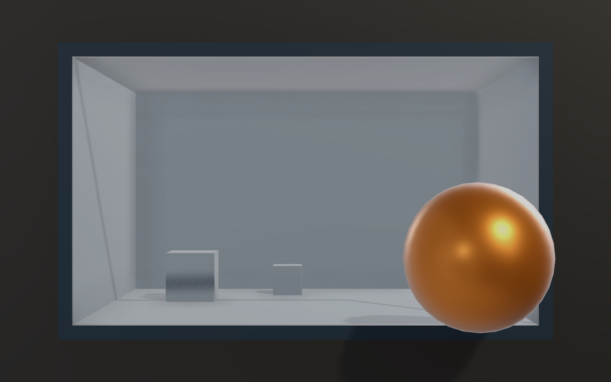

# Billboard Illusion Mode

An optional scene layer for a head-tracked physical window: a recessed chamber, a screen-plane frame, a dark surround, and an ordinary 3D object that can extend in front of the frame. The existing eye tracking, filtering, calibration, camera orientation, and off-axis projection continue to drive the same camera.

## Try the demo

Run [`Run-BillboardTest.cmd`](../Run-BillboardTest.cmd), or enable **Billboard Illusion Mode** in the demo settings. Enter the measured visible display dimensions through **Display size** first. Do not include the monitor bezel.

- Start with **Animate in/out** off. Move sideways, vertically, and towards/away from the screen while watching the fixed object.
- Toggle **Frame / dark surround** to compare the depth cue with the same tracking and object placement.
- Choose a metal sphere, miniature bear, or miniature chair. **Model height** describes the miniature's actual height in centimetres; it is not a tracking gain.
- Adjust chamber depth, horizontal position, and model centre depth. Positive depth is behind the display; negative is towards the viewer.
- Turn on animation to demonstrate passing through the frame. This intentionally moves the object and is separate from the fixed-object tracking test.
- **F1** hides/shows the panels. **Save billboard settings and mode** persists the selection and parameters.
- Turning the mode off restores the previous scene visibility and model transforms. **Reset demo to defaults** restores the full original layout and billboard defaults while retaining physical screen/camera calibration.

The default opening is 76% of display width and 70% of height. The chamber is 22 cm deep, the target is 8 cm tall, and its static bounds centre is 3.5 cm in front of the display. Its offset near the right rim makes depth ordering easy to see. Two optional rear blocks provide scale and depth references.



## Edge stability and rendering speed

The demo defaults to **Stable edges** on, **Contact AO** off, and **Render scale** at 85%. These settings are saved with the billboard layout; older saved layouts use the new defaults. Reset restores these defaults while preserving measured display/camera calibration.

| Setting | Effect |
| --- | --- |
| Stable edges | URP TAA at Medium quality, 75% history blend, 0.75 jitter scale, no sharpening or negative mip bias. Disables MSAA as required by TAA. Switch off to compare 4× MSAA. |
| Contact AO | Optional screen-space ambient occlusion. Off avoids the extra occlusion/blur work and its small-scale shading artifacts; direct shadows and material shading remain. |
| Render scale | 65–100% of each image dimension. Default 85% produces about 72% of the full-resolution pixel count. The entire physical display still maps to the same off-axis projection. Lower values soften detail. |
| Shadow coverage | One cascade covers the calibrated maximum viewing distance plus chamber/content depth and a 30 cm margin. This replaces the normal scene's 8 m, two-cascade range while billboard mode is active. |
| Rendering FPS | A half-second average of Unity frame intervals, including frame pacing. The demo targets 60 FPS; this counter does not measure tracking latency or isolated GPU time. |

Rim and chamber faces now have disjoint depth intervals, with 0.5 mm clearance, to remove coplanar depth fighting. Static content only writes its transform when its position changes. The profile restores camera anti-aliasing, MSAA, shadow coverage, render scale, and AO when the mode exits or the demo is destroyed. Tracking filters and physical model placement are unchanged.

[Unity's anti-aliasing reference](https://docs.unity.com/en-us/engine/6000.3/manual/render-pipelines/universal-render-pipeline/anti-aliasing) explains why MSAA alone does not address specular/texture aliasing and why TAA can leave trails during fast motion. Compare **Stable edges** on/off while moving slowly first, then quickly. If trails are distracting, use the MSAA comparison. Start with animation and Contact AO off, then enable each separately. Compare FPS at the same render scale and camera pose after the first few seconds of warm-up. Overall GPU cost depends on history/motion-vector processing as well as pixel count.

The URP profile belongs to the demo. Host projects choose their own anti-aliasing and shadow settings; the package does not change a host's pipeline assets.

## Use the package in another project

The implementation lives in `Packages/com.headtracked.display/Runtime`, under the MIT license. It has no dependency on the demo, its models, URP assemblies, MediaPipe, or an additional camera. Install the [package](../Packages/com.headtracked.display/README.md) and configure an existing `HeadTrackedDisplay` first.

Add `BillboardIllusionController` to a GameObject and assign the display and an optional model prefab in the Inspector, or configure it from your scene setup code:

```csharp
using HeadTracked.Display;
using UnityEngine;

public sealed class BillboardSetup : MonoBehaviour
{
    public HeadTrackedDisplay display; // Already configured with the physical screen and a source.
    public GameObject modelPrefab;
    public Material frame, surround, chamber;

    void Start()
    {
        var rig = gameObject.AddComponent<BillboardIllusionController>();
        rig.frameMaterial = frame;
        rig.surroundMaterial = surround;
        rig.chamberMaterial = chamber;
        rig.Settings.boxDepth = .22f;
        rig.Settings.contentHeight = .08f;
        rig.Settings.staticDepth = -.035f;
        rig.Configure(display, modelPrefab);
    }
}
```

Assign materials authored for the host project's rendering pipeline, especially in a player build where shader variants may be stripped. Runtime fallbacks use URP Lit or Standard when available. The package does not install a pipeline or change global lighting. Existing lights/shadows and optional ambient occlusion provide shading.

The rig follows `display.ScreenPlane` (or the world origin if none is assigned). The screen Transform must have unit scale. Geometry uses screen-local metres, +Z into the scene. Physical width/height come from `display.Calibration`; changes resize the chamber/frame. The full physical screen remains the projection surface. The smaller inner opening does not replace the display calibration.

## Public API and ownership

| API | Purpose |
| --- | --- |
| `Configure(display, prefab)` | Connect to the existing display and create an owned visual clone. Null prefab selects a sphere. |
| `Settings` | Serializable `BillboardIllusionSettings` with metre lengths, opening fractions, visibility, and animation controls. |
| `SetContent(prefab)` | Replace the visual clone while retaining source materials and submesh slots. |
| `Refresh()` | Apply changed dimensions/settings immediately; also runs in LateUpdate. |
| `enabled` | Show/hide the generated rig without disabling head tracking. |
| `ContentInstance`, `RigRoot` | Inspect the generated clone and physical-screen-space geometry. |

Source models are not moved or rescaled. The clone is uniformly scaled to `contentHeight` and centred using renderer bounds. Use render-only model prefabs: scripts/animators on an instantiated prefab still execute, and clone colliders are removed because this component is a visual demonstration. Existing source colliders/materials are untouched. Model proportions and material references are preserved; custom shaders must support the host pipeline. Extremely deep models may intersect the chamber or camera near plane and need adjusted size/depth.

Generated geometry and fallback materials are owned and destroyed by the controller. Assigned materials belong to the caller. Once geometry is built, static dimension/visibility/material updates occur only when values change; the reusable controller performs no per-frame environment capture, new face inference, or additional full-screen render. The demo's optional TAA adds URP history and motion-vector processing. Animation changes the clone position only. Actual GPU/frame time must be measured on the target hardware.

Settings can be serialized with `JsonUtility`; the reusable component performs no disk writes and opens no webcam. The demo saves its mode/settings in `demo_model_layout.json` and handles comparison visibility itself. Older layout files without billboard fields retain their existing mode.

## Geometry, verification, and limits

The frame and surround sit at the physical screen plane, with thin 3D rims. Ordinary depth testing lets objects behind it be occluded and objects in front cover it. The enclosure, shadows, and reference blocks add pictorial depth cues. There is no additional image warp, model rotation driven by the head, or change to tracking gain.

Tests check an independent package rig on a translated/rotated screen, source model/material/calibration preservation, static transform reuse, disjoint rim/chamber faces, resizing and enable/disable lifecycle, rendered front/behind occlusion, and restoration of an existing demo comparison. A demo test renders TAA history at three off-axis eye positions, checks the physical screen corner and unchanged camera projection, and verifies rendering-profile restoration. Existing projection and tracking tests remain applicable.

Validation passed 35 EditMode and 11 PlayMode tests. All three package billboard tests also passed in a separate Unity URP project with no demo scripts/resources. The Windows player built and the billboard launcher connected the Python webcam tracker; closing it released the tracker. These checks do not establish perceived realism, full motion latency, or sustained frame rate with a live viewer.

The black surround reserves **screen pixels** for crossing the virtual frame. The actual monitor bezel still clips output. This does not produce stereoscopic eye separation or change the physical focus distance. Perceived realism and benefit over the normal mode require a human comparison on a calibrated monitor. This first version targets one planar full-screen display, not a physical L-shaped or multi-panel LED installation.

The scene design is an engineering adaptation of anamorphic billboard presentation. [LG's production guide](https://www.lg.com/us/wonderbox/Wonderbox-GuidelinesSpecs.pdf) describes modelling the actual screen and choosing a static viewing sweet spot; this implementation uses the existing live observer-relative projection instead of baking one fixed-view video. See [physical geometry](physical-scale.md) and [rendering setup](rendering.md).
