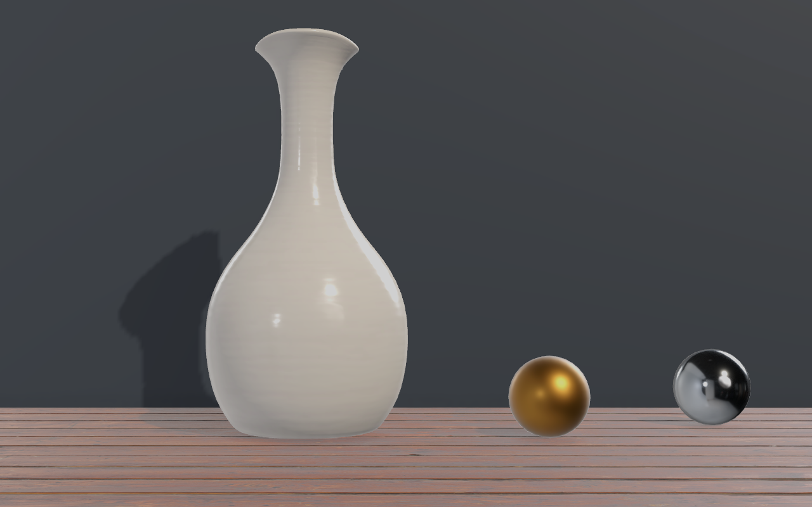

# Surface realism and physical display setup

## Run the comparison

Close the previous demo and double-click **Run-RealismTest.cmd**. The physical-window view shows a 40 cm ceramic vase, two 8 cm metal spheres, and textured wood. Press **F1** to hide/show all diagnostic panels. **Enhanced rendering** compares MSAA, soft shadows, and SSAO without changing tracking or placement.

The vase is 85 cm behind the screen; spheres are 80/90 cm behind it. Their bottoms rest on the wood. **Restore all models and original positions** returns to the full demo. **Save calibration** persists the layout.

## Match the physical display first

The demo enables **Full-screen square pixels: derive height from measured width**:

```text
heightMetres = measuredWidthMetres * renderPixelHeight / renderPixelWidth
```

At 2880×1800, a 53 cm width implies a 33.125 cm height; a 34 cm width implies 21.25 cm. This fixes the ratio, not the absolute scale. Measure the visible panel without its bezel, enter the width, and check **both 10 cm rulers** with a physical ruler. Save afterwards.

When exactly one active panel reports dimensions, the launcher reads an EDID hint. These are rounded centimetres, not measurements. If saved dimensions still equal the old 53×30 cm example, the demo uses the reported width provisionally. Other saved dimensions are retained. **Use reported panel width (estimate)** reapplies the hint. Multiple displays require manual measurement; the launcher removes an old hint instead of guessing a panel.

Disable automatic height derivation to enter two independent measurements. The package exposes `DisplayCalibration.deriveScreenHeightFromResolution`, default **false**. This mode assumes a full-panel camera. Smaller windows or letterboxed views need their actual physical viewport dimensions and position. Recheck the rulers after changing display scaling or resolution.

## Rendering changes

| Area | Implementation |
| --- | --- |
| Materials | Preserve URP/custom materials and submesh slots. Translate known Standard/legacy diffuse properties to URP Lit. Flat fallback only for missing slots. |
| PBR | Ceramic albedo, GL normal, roughness, metallic, AO; wood albedo, normal, roughness, AO. |
| Channels | Albedo is sRGB; data maps are linear. Metallic is R and smoothness (`1 - roughness`) is A. Grayscale AO supplies G. |
| Environment | Prefiltered HDR reflections and an offline sampled L2 spherical-harmonic ambient probe. No per-frame environment capture. |
| Shadows | 2048 main-light map, two cascades, soft filtering, metre-scale bias. |
| Contact shading | Half-resolution SSAO, 2.5 cm radius, 8 samples, bilateral blur; approximate occlusion, not ray-traced indirect light. |
| Image | Linear colour, HDR, 4× MSAA, Neutral tonemapping. No artificial depth of field or motion blur. |

Vase maps import up to 2K, wood up to 1K, and the cubemap at 512 per face. Higher quality uses GPU time; tracking inference is unchanged. Sustained frame rate and presentation latency need a live test at the target resolution.



This image uses a 34 cm width, 16:10 viewport, and neutral 60 cm eye distance. It demonstrates rendering, not webcam accuracy or perceived realism.

## Reproduction and limits

Assets and generated settings are checked in. To fetch sources and repack maps:

```powershell
./python_tracker/.venv/Scripts/python.exe tools/fetch_render_assets.py
```

Then run **Head Tracked → Configure realistic surface comparison** in Unity. The editor script creates import settings, vase material remapping, lighting resources, ambient coefficients, and URP settings. `Realism/sources.json` records upstream files, hashes, and licenses.

Kenney meshes remain deliberately simplified: preserving materials restores surface separation, not scanned geometry or bevels. Use detailed, physically scaled PBR assets for realistic content. Retained custom shaders must support URP themselves.

The studio environment is a demonstration, not a measurement of the viewer's room. Room lighting, screen brightness/white balance, object scale, eye distance, and latency also matter. A normal monitor still presents one focal plane and one image to both eyes; better rendering does not establish that a viewer will mistake it for a physical object.

Sources: [ceramic vase](https://polyhaven.com/a/ceramic_vase_01), [wood](https://polyhaven.com/a/wood_floor_deck), [studio HDRI](https://polyhaven.com/a/studio_small_09), [CC0 license](https://polyhaven.com/license), [Unity SSAO](https://docs.unity3d.com/6000.0/Documentation/Manual/urp/ssao-renderer-feature-reference.html), [ambient probe](https://docs.unity3d.com/6000.0/Documentation/ScriptReference/RenderSettings-ambientProbe.html). See [attribution](../THIRD_PARTY.md).
